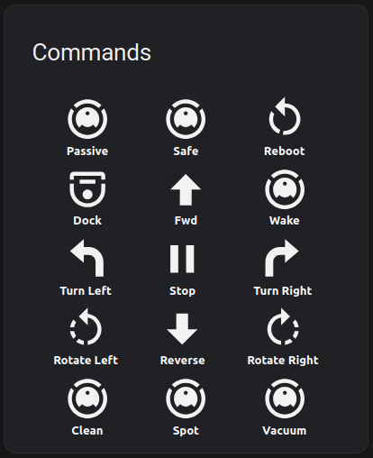

# ESPHomeRoomba

Following on from the fine work of mannkind, davidecavestro, and wburgers...

An update of the ESPHomeRoombaComponent.h to add new sensors and new control commands, and to provide a dashboard in Home Assistant for Sensors and Control.

The Vacuum commands turn on the main brush, side brush, and vacuum when you are in Safe Mode, so you can drive the vacuum to where you wish to vacuum stuff without having to use Clean or Spot.

The displayString function is used to display 4-character ASCII codes on the display (e.g. "FWD " for the go_forward command).

New Sensors:
-----------

    Main Brush Current
    Side Brush Current

New Binary Sensors:
------------------

    Vacuum State

New Commands:
------------

    rotate_left
    rotate_right
    vacuum_on
    vacuum_off

New Functions:
-------------

    displayString

See also the Roomba dashboard.yaml file for the Sensors and Control Buttons.


A Dashboard using the HACS Universal Remote Card



The control buttons are placed as button rows on an entities card, and use the tap action to call the command service of the roomba component:

```
        tap_action:
          action: call-service
          service: esphome.roomba_command
          data:
            command: passive
          target: {}
```

I also created an input helper template switch for the vacuum functions:

Template Switch

E.g. create an input_switch helper called switch.vacuum

value template:
```
    {{ (states('binary_sensor.roomba_roomba_vacuum_state')) }}
```
Action on turn on:
```
action: esphome.roomba_command
data:
  command: vacuum_on
target: {}
```
Action on turn off:
```
action: esphome.roomba_command
data:
  command: vacuum_off
target: {}
```

I then linked this switch to the Vacuum button on the Roomba Dashboard (this button uses the toggle action).

